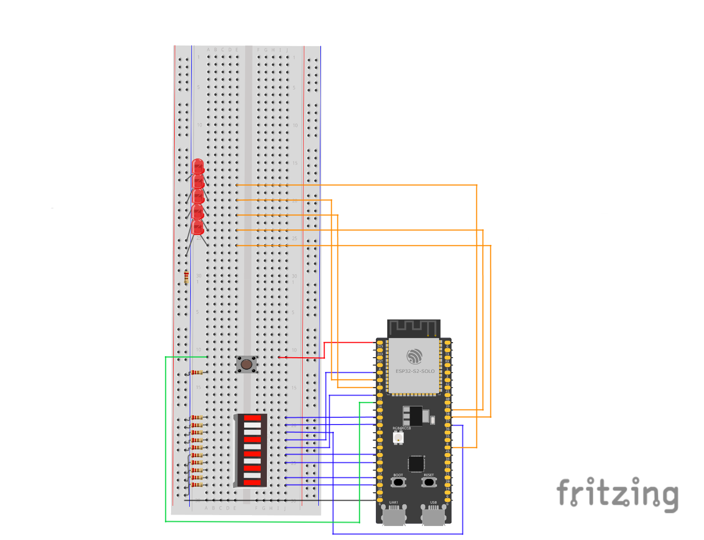

door Mike Schardijn IT101 500911074 13-1-2023
Dit is eindopdracht B, pong

om te beginnen moet je je naam invoeren via het UART component. voer deze in kleine letters
in en druk op P (hoofdletter p) om te bevestigen. dan zal het pong spel starten.

Het "pingpongballetje" gaat heen en weer. Wanner het een kant raakt en er wordt niet op de knop
gedrukt om hem terug te sturen verliesje een leven. Je verliest ook een leven als je op de knop
drukt terwijl het "pingpongballetje" niet bij een van de zijkanten is.

Als je wel op tijd op de knop drukt dan krijg je een punt, deze wordt even in binair op de 
ledbar weergegeven en dan gaat het spel weer door.

Naarmate je meer punten beweegt gaat het "pingpongballetje"sneller

Het spel eindigt als je levens op nul staan nadat je er 5 verloren bent
De 5 rode LED_lampjes geven tijden shet spel je levens weer.

Wanneer het spel voorbij is zullen alle ledlampjes knipperen
en krijg je, als je er naar wilt kijken, je naam en score te zien op de monitor.
